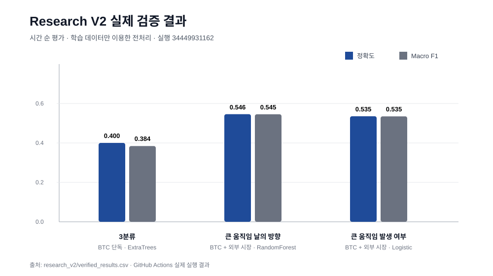

# 시장 방향 예측 연구

Bitcoin과 전통 금융시장 데이터를 이용해 **다음 날 가격 움직임을 상승·횡보·하락으로 분류하고, 기존 평가 방식의 문제를 다시 점검한 뒤 더 엄격한 시계열 평가로 재검증한 연구 프로젝트**입니다.

이 저장소는 학사 연구 당시의 LSTM, GRU, Transformer 실험을 그대로 보존하면서, 결과를 더 좋아 보이게 수정하는 대신 **기존 결과를 어디까지 신뢰할 수 있는지 다시 확인하고 평가 방식을 개선한 과정**을 함께 기록합니다.

> 핵심은 모델 구조보다 **데이터 누수, 시간 순 분할, 기준 모델, 평가 지표, 반복 검증**을 먼저 확인하는 것입니다.

---

## 1. 무엇을 예측했는가

이 연구는 내일의 Bitcoin 가격 자체를 숫자로 예측하는 회귀 문제가 아닙니다.

오늘 종가 대비 다음 날 종가 수익률을 기준으로 3개 방향을 분류합니다.

```python
return_t_plus_1 = close.pct_change().shift(-1)

상승 = return_t_plus_1 > 0.01
횡보 = -0.01 <= return_t_plus_1 <= 0.01
하락 = return_t_plus_1 < -0.01
```

즉:

```text
다음 날 수익률 > +1%  → 상승
-1% ~ +1%             → 횡보
다음 날 수익률 < -1%  → 하락
```

±1%는 기존 연구에서 작은 움직임과 비교적 큰 방향 움직임을 구분하기 위해 사용한 고정 기준입니다. 이 값이 통계적으로 최적이라고 주장하지 않습니다. 추가 연구에서는 여러 기준값 비교나 변동성에 따른 가변 기준을 검토할 수 있습니다.

---

## 2. 원래 연구

초기 연구에서는 BTC 가격·거래량·기술지표와 여러 금융시장 데이터를 이용해 LSTM, GRU, Transformer를 비교했습니다.

원래 보고된 결과:

| 모델 | 테스트 손실 | 테스트 정확도 | 기존 사용자 정의 정확도 | 테스트 F1 |
|---|---:|---:|---:|---:|
| LSTM | 1.4929 | 0.2979 | 0.3750 | 0.2574 |
| GRU | 1.5055 | **0.3739** | 0.5321 | **0.3730** |
| Transformer | **1.1344** | 0.3313 | **0.5440** | 0.3260 |

LSTM, GRU, Transformer는 모두 **과거 60일을 보고 다음 날 방향을 예측하는 60일 시퀀스**를 사용했습니다.

```text
과거 60일의 기술지표
  ↓
LSTM / GRU / Transformer
  ↓
다음 날 상승 / 횡보 / 하락
```

60일이 통계적으로 최적이라고 증명한 것은 아닙니다. 현재 저장소의 원래 연구에서 사용한 고정 설정이며, 다시 연구한다면 30·60·90일 등 여러 기간을 검증 데이터에서 비교해야 합니다.

---

## 3. 기존 평가 방식에서 발견한 문제

포트폴리오를 정리하면서 모델을 추가하기보다 먼저 기존 코드를 다시 점검했습니다.

### 문제 1. 전처리 단계의 미래 정보 유입 가능성

기존 코드에서는 전체 데이터에 표준화 기준을 학습한 뒤 학습·테스트 데이터를 나눴습니다.

```text
전체 데이터
  ↓ 표준화 기준 계산
전체 데이터 변환
  ↓
학습 / 테스트 무작위 분할
```

이 경우 미래 테스트 구간의 평균이나 분산 정보가 전처리 기준에 반영될 수 있습니다.

### 문제 2. 시계열 데이터를 무작위로 분할

실제 예측은 항상 과거 데이터로 미래를 예측합니다.

```text
과거 → 미래
```

하지만 무작위 분할은 서로 다른 시점의 데이터를 섞기 때문에 실제 사용 상황과 다릅니다.

---

## 4. 개선한 평가 방식

Research V2에서는 시간 순서를 보존합니다.

```text
과거                                      미래
|----------- 학습 60% -----------|-- 검증 20% --|-- 테스트 20% --|
```

원칙:

1. 시간 순서대로 학습·검증·테스트 분리
2. 표준화와 전처리 기준은 학습 데이터에서만 계산
3. 검증 데이터에서 모델과 변수 구성을 선택
4. 테스트 데이터는 최종 평가에 한 번 사용
5. 단순 기준 모델과 반드시 비교
6. 한 번의 테스트 구간뿐 아니라 시간 이동 검증으로 안정성 확인

기존 연구와 V2의 평가 조건이 다르기 때문에 **GRU 37.39%와 V2 40.00%를 직접적인 2.61%p 성능 개선이라고 주장하지 않습니다.**

---

## 5. Research V2의 변수 구성

V2는 LSTM처럼 고정 60일 시퀀스를 그대로 넣는 구조가 아닙니다.

가격 수준 자체보다 시점이 바뀌어도 비교하기 쉬운 상대값을 중심으로 사용합니다.

예:

- 1·2·3·5·10일 과거 수익률
- 이동평균 대비 현재 가격 비율
- 이동평균 수렴·확산 지표를 가격으로 나눈 값
- 평균 진폭을 가격으로 나눈 값
- 볼린저 밴드 내 위치와 폭
- 장중 가격 범위 비율
- 거래량 변화율

기존 데이터의 `return` 열은 다음 날 수익률을 이용해 만들어진 목표값이므로 입력 변수에서 제외합니다.

---

## 6. 왜 단순 기준 모델이 필요한가

3분류 문제라고 해서 정확도 40% 하나만 보고 예측력이 있다고 판단할 수 없습니다.

특정 클래스가 더 많이 등장하면 그 클래스만 계속 예측해도 높은 정확도가 나올 수 있기 때문입니다.

그래서 가장 많이 등장한 클래스를 계속 예측하는 기준 모델과 비교합니다.

V2의 최종 3분류 결과:

| 항목 | 결과 |
|---|---:|
| 모델 | ExtraTrees |
| 변수 | BTC 단독 |
| 테스트 정확도 | **40.00%** |
| 균형 정확도 | **38.75%** |
| Macro F1 | **38.44%** |
| 다수 클래스 기준 정확도 | 29.30% |
| 다수 클래스 기준 Macro F1 | 15.11% |

같은 평가 조건에서:

```text
정확도       29.30% → 40.00%  (+10.70%p)
균형 정확도  33.33% → 38.75%  (+5.42%p)
Macro F1     15.11% → 38.44%  (+23.33%p)
```

이 결과는 Bitcoin을 높은 정확도로 예측했다는 뜻이 아니라 **시간 순서를 지킨 평가에서도 단순 기준 모델보다 추가적인 분류 신호가 남아 있었음**을 의미합니다.

---

## 7. 왜 정확도만 보지 않는가

### 정확도
전체 표본 중 맞힌 비율입니다. 클래스 비율이 불균형하면 특정 클래스만 많이 예측해도 높게 나올 수 있습니다.

### 균형 정확도
상승·횡보·하락의 재현율을 같은 비중으로 평균합니다.

### Macro F1
세 클래스의 F1을 같은 비중으로 평균해 소수 클래스도 함께 평가합니다.

### 혼동행렬
어떤 클래스를 어떤 클래스로 잘못 예측했는지 확인합니다.

따라서 모델 선택에서는 **정확도 하나가 아니라 균형 정확도와 Macro F1을 함께 봅니다.**

---

## 8. 외부 시장 변수가 항상 도움이 되는가

BTC 자체 변수와 ETF·금 등 외부 시장 변수를 추가한 경우를 같은 문제에서 비교했습니다.

### 전체 날짜 3분류

| 변수 구성 | 정확도 | 균형 정확도 | Macro F1 |
|---|---:|---:|---:|
| BTC 단독 | **40.00%** | **38.75%** | **38.44%** |
| BTC + 외부 시장 | 38.59% | 37.85% | 37.72% |

전체 날짜 3분류에서는 외부 시장 변수를 넣었을 때 오히려 성능이 낮아졌습니다.

### ±1% 이상 움직인 날의 방향 예측

| 변수 구성 | 모델 | 정확도 | 균형 정확도 | Macro F1 |
|---|---|---:|---:|---:|
| BTC 단독 | RandomForest | 51.97% | 51.89% | 51.89% |
| BTC + 외부 시장 | RandomForest | **54.59%** | **54.82%** | **54.51%** |

큰 움직임이 발생한 날의 상승·하락 방향에서는 외부 시장 변수가 도움이 됐습니다.

따라서 **변수의 가치는 예측 문제에 따라 다르며 외부 데이터를 많이 넣는다고 항상 좋아지는 것은 아니다**라고 해석합니다.

---

## 9. 큰 움직임 발생 여부 예측

방향과 별도로 다음 질문도 실험했습니다.

> 내일 ±1% 이상의 큰 움직임이 발생하는가?

BTC + 외부 시장 Logistic 모델:

- 정확도: `53.52%`
- 균형 정확도: `56.93%`
- Macro F1: `53.47%`
- ROC AUC: `57.18%`

이 문제에서는 다수 클래스 기준 모델의 정확도가 더 높았습니다. 하지만 균형 정확도와 Macro F1에서는 학습 모델이 더 높았습니다.

이 결과는 **클래스 불균형 문제에서는 정확도만 보면 잘못된 결론을 내릴 수 있음**을 보여줍니다.

---

## 10. 확신도가 낮을 때 예측하지 않는 실험

모든 날짜에 강제로 답을 내는 대신 모델이 충분히 확신하는 날짜만 예측하는 실험도 진행했습니다.

첫 3분류 실험:

- 확신도 기준: `0.65`
- 예측 범위: `31.93%`
- 정확도: `42.11%`

큰 움직임 발생 여부 예측에서 확인한 한 구간:

- 확신도 기준: `0.65`
- 예측 범위: `23.10%`
- 정확도: **64.63%**
- 균형 정확도: **64.94%**
- Macro F1: **64.20%**

64.63%를 전체 테스트 정확도처럼 말하지 않습니다. **전체 날짜 중 약 23%만 예측한 결과**이므로 예측 범위와 반드시 함께 설명합니다.

```text
예측 품질을 높이면
→ 예측하는 날짜 수가 줄어들 수 있음
```

---

## 11. 시간 이동 검증

한 번의 테스트 구간이 우연히 잘 맞았는지 확인하기 위해 시간 순서를 유지하며 여러 구간에서 반복 평가합니다.

첫 엄격한 V2 실험:

```text
Macro F1 평균 = 0.3485
Macro F1 표준편차 = 0.0198
```

평균 점수뿐 아니라 구간별 변동도 함께 보는 이유는 금융시장의 특성이 시간에 따라 달라질 수 있기 때문입니다.

실제 운영 모델로 확장한다면 재학습 주기, 데이터 분포 변화, 거래비용, 확률 보정, 시장 상황별 성능까지 추가로 확인해야 합니다.

---

## 12. 실제 투자 수익률을 주장하지 않음

분류 정확도는 투자 수익률과 같지 않습니다.

현재 연구에는 다음 요소가 완전한 투자 전략 형태로 포함되어 있지 않습니다.

- 거래 수수료
- 슬리피지
- 시장 충격
- 포지션 크기 결정
- 손절·위험 관리
- 실제 거래 규칙 기반 백테스트

따라서 **“이 모델로 수익을 낼 수 있다”는 결론은 내리지 않습니다.**

실제 투자 전략으로 확장하려면:

```text
예측 지표
→ 매매 규칙
→ 백테스트
→ 거래비용 반영 수익률
→ 위험 지표
```

단계가 추가되어야 합니다.

---

## 13. 재현성

설치:

```bash
pip install -r requirements-research-v2.txt
```

기본 V2 실험:

```bash
python research_v2/run_research.py
```

확장 실험:

```bash
python research_v2/run_extended_research.py
```

GitHub Actions에서도 같은 코드를 실행해 결과 파일을 생성합니다.

실제 검증 결과:

- 실행 번호: `34449931162`
- 검증 커밋: `d81f044c91f41e65ff1e4758b530033067e2d1b9`
- Python 3.11
- 결과 기록: [`research_v2/VERIFIED_RESULTS.md`](research_v2/VERIFIED_RESULTS.md)
- CSV 결과: [`research_v2/verified_results.csv`](research_v2/verified_results.csv)



---

## 14. 기존 연구에서 실제로 개선한 것

가장 큰 개선은 모델의 층 수나 하이퍼파라미터가 아닙니다.

```text
기존
모델 비교
→ 가장 높은 점수 선택

현재
기존 평가 점검
→ 데이터 누수 가능성 확인
→ 시간 순 분할
→ 학습 데이터만으로 전처리 기준 계산
→ 단순 기준 모델 비교
→ 여러 평가 지표 확인
→ 외부 시장 변수 구성 비교
→ 시간 이동 검증
→ 예측 범위와 확신도 비교
→ GitHub Actions 재실행
```

핵심은 **좋은 숫자를 만드는 것에서, 같은 실험을 다시 실행해도 결론을 검증할 수 있게 만드는 것으로 연구의 기준을 바꾼 것**입니다.

---

## 15. 저장소 구조

```text
.
├── 1.data.ipynb
├── 2.preprocessing.ipynb
├── 3.labeled.ipynb
├── 4.standard.ipynb
├── 5-0.lstm.ipynb
├── 6-0.gru.ipynb
├── 7-0.transformer.ipynb
├── 1.used_data/
├── 3.Labeled_data/
├── model_performance_results.csv
├── LSTM_model.h5
├── GRU_model.h5
├── Transformer_model.keras
├── research_v2/
│   ├── run_research.py
│   ├── run_extended_research.py
│   ├── verified_results.csv
│   └── VERIFIED_RESULTS.md
├── docs/
│   ├── REPRODUCIBILITY.md
│   ├── MODEL_EVALUATION.md
│   ├── RESEARCH_DECISIONS.md
│   └── INTERVIEW_GUIDE.md
└── .github/workflows/research-v2.yml
```

---

## 16. 면접 답변 요약

> 다음 날 Bitcoin 수익률이 +1%를 넘으면 상승, -1% 아래면 하락, 그 사이는 횡보로 정의한 3분류 연구입니다. 기존에는 60일 시퀀스로 LSTM, GRU, Transformer를 비교했고 GRU 정확도가 37.39%로 가장 높았습니다. 하지만 전체 데이터로 전처리 기준을 계산한 뒤 시간을 섞어 학습·테스트를 나눈 문제가 있어 결과를 그대로 개선 수치로 사용하지 않았습니다. V2에서는 시간 순으로 60/20/20을 나누고 전처리 기준도 학습 데이터에서만 계산했습니다. 같은 조건의 다수 클래스 기준 모델이 29.30%였고 BTC 단독 ExtraTrees가 40.00%를 기록했습니다. 핵심은 높은 정확도를 주장하는 것이 아니라 미래 정보 유입을 막고 기준 모델과 시간 이동 검증으로 결과를 다시 확인한 것입니다.

### 자주 나오는 질문

- 상승·횡보·하락을 어떤 기준으로 정의했는가?
- 왜 ±1%를 사용했는가?
- 기존 딥러닝 모델의 입력 기간은 몇 일이었는가?
- 왜 시계열 데이터에서 무작위 분할이 위험한가?
- 전처리 기준을 학습 데이터에서만 계산해야 하는 이유는?
- 3개 클래스인데 40% 정확도가 어떤 의미가 있는가?
- 왜 정확도와 Macro F1을 같이 보는가?
- 기존 GRU 37.39%와 새 40.00%를 직접 비교하면 안 되는 이유는?
- 외부 시장 데이터를 넣었는데 왜 3분류 성능은 떨어졌는가?
- 64.63%라는 숫자를 전체 정확도라고 말하면 안 되는 이유는?
- 시간 이동 검증은 무엇을 확인하는가?
- 예측 정확도와 실제 투자 수익률은 왜 다른가?

상세 답변은 [`docs/INTERVIEW_GUIDE.md`](docs/INTERVIEW_GUIDE.md)에 정리합니다.

---

## 결론

이 연구의 결론은 **“Bitcoin을 높은 정확도로 예측했다”가 아닙니다.**

1. 금융 시계열에서는 모델 구조보다 먼저 시간 순서를 지킨 평가가 필요합니다.
2. 기준 모델 없이 정확도 하나만 보면 모델의 실제 추가 가치를 오판할 수 있습니다.
3. 외부 시장 변수는 예측 문제에 따라 도움이 되기도 하고 그렇지 않기도 했습니다.
4. 확신도가 높은 구간만 예측하면 정확도가 오를 수 있지만 예측 범위가 줄어들기 때문에 둘을 함께 봐야 합니다.
5. 연구 결과를 포트폴리오로 설명할 때 가장 중요한 것은 숫자를 좋게 만드는 것이 아니라 **평가 과정을 다시 실행하고 반박 가능한 형태로 남기는 것**입니다.