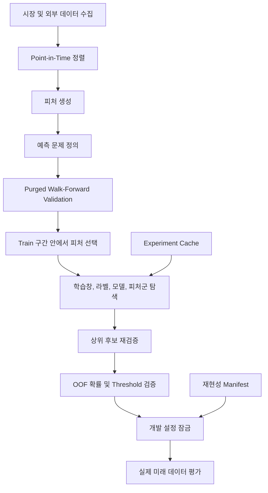

# Market Prediction Research

> **Bitcoin의 다음 날 가격을 무조건 맞히는 모델이 아니라, 미래정보 누수를 차단한 시계열 검증에서도 실제로 남는 예측 신호가 무엇인지 확인한 연구 프로젝트입니다.**

이 프로젝트는 Bitcoin 가격과 거래량, 다른 암호자산, 전통 금융시장, 온체인 지표, 투자심리 데이터를 이용해 다음 날 시장 움직임을 연구합니다.

처음에는 LSTM, GRU, Transformer를 이용해 상승, 횡보, 하락을 분류하는 방식으로 시작했습니다. 이후 기존 평가 방식을 다시 점검하면서 시계열 데이터를 무작위로 나누는 문제, 전체 데이터에서 전처리 기준을 계산하는 문제, 이미 확인한 테스트 구간을 다시 튜닝에 사용하는 문제를 발견했습니다.

그래서 모델을 더 복잡하게 만드는 대신 **검증 체계를 먼저 다시 설계하고, 어떤 문제 정의가 실제로 더 안정적인지 비교하는 방향으로 연구를 확장했습니다.**

---

## 1. 연구 질문

이 프로젝트에서 확인하고 싶은 핵심 질문은 다음과 같습니다.

```text
오늘까지 알 수 있는 정보만 사용했을 때
내일 Bitcoin의 움직임에 반복 가능한 신호가 남아 있는가?
```

이를 위해 같은 데이터에서 여러 문제를 비교했습니다.

| 예측 문제 | 주요 개발 결과 | 해석 |
|---|---:|---|
| 상승, 횡보, 하락 3분류 | Macro F1 0.4445 | 방향 분류 신호는 제한적이었습니다. |
| 상승, 하락 2분류 | ROC AUC 0.5130 | 거의 무작위 수준이었습니다. |
| 다음 날 수익률 회귀 | Pearson 약 0 | 수익률 숫자를 직접 맞히는 신호는 약했습니다. |
| 큰 움직임 발생 여부 | ROC AUC 0.7212 | 가장 안정적인 신호가 관찰되었습니다. |

결과적으로 최종 연구에서는 다음 질문에 집중했습니다.

> **오늘까지의 정보로, 내일 Bitcoin의 절대수익률이 최근 변동성보다 의미 있게 커질지를 예측할 수 있는가?**

---

## 2. 비전공자를 위한 문제 설명

가격 예측이라고 하면 보통 "내일 가격이 얼마인가"를 떠올릴 수 있습니다.

하지만 금융시장의 하루 수익률은 잡음이 매우 크고, 작은 상승과 큰 급등을 모두 단순히 "상승"으로 묶으면 정보가 많이 사라집니다.

그래서 다음 두 질문을 분리했습니다.

```text
질문 A
내일 가격이 오를까요, 내릴까요?

질문 B
내일 평소보다 큰 움직임이 발생할까요?
```

실험 결과 질문 A는 거의 무작위 수준이었지만, 질문 B에서는 상대적으로 안정적인 신호가 남았습니다.

최종 MOVE 기준은 다음과 같습니다.

```text
MOVE = 1
if abs(내일 수익률) > 1.1 × 최근 7일 변동성

MOVE = 0
otherwise
```

고정된 1%를 모든 시기에 적용하는 대신, 최근 시장이 조용한지 급격한지에 따라 기준도 함께 달라지도록 만들었습니다.

---

## 3. 시스템 아키텍처



시스템은 크게 네 영역으로 나눌 수 있습니다.

| 영역 | 역할 |
|---|---|
| 데이터 계층 | BTC와 외부 데이터를 수집하고 예측 시점 기준으로 정렬합니다. |
| 피처 계층 | 가격 변화, 변동성, 상대시장 움직임, 온체인 지표 등을 모델 입력으로 만듭니다. |
| 연구 계층 | 시간 순서를 지킨 검증에서 문제 정의, 학습 기간, 피처군, 모델을 비교합니다. |
| 재현성 계층 | 코드, 데이터, 설정, 패키지 환경을 기록해 같은 실험을 다시 추적할 수 있게 합니다. |

---

## 4. 사용한 데이터

### Bitcoin 자체 정보

```text
가격과 거래량
단기 및 중장기 수익률
로그수익률
변동성과 하방 변동성
이동평균 대비 가격 위치
RSI
MACD
Bollinger Band
거래량 이상치
고점 대비 낙폭
캔들 구조와 가격 범위
```

### 다른 암호자산

```text
ETH
BNB
XRP
SOL
ADA
DOGE
LTC
```

단순히 각 코인의 가격을 넣지 않고 Bitcoin이 전체 암호시장과 비교해 강한지 약한지를 표현했습니다.

예를 들면 다음과 같습니다.

```text
BTC 수익률 - ETH 수익률
BTC 수익률 - 암호시장 평균 수익률
암호시장 상승 종목 비율
BTC와 암호시장 평균의 rolling correlation
BTC의 crypto basket beta
시장 공통 움직임을 제외한 BTC residual return
```

### 전통 금융시장

```text
SPY
QQQ
Gold
DXY
VIX
TLT
```

Bitcoin은 주말에도 거래되지만 미국 금융시장은 휴장합니다. 따라서 단순히 날짜를 맞추는 것만으로는 충분하지 않습니다.

이미 알려진 마지막 값을 이후 날짜로 전달하되 미래 값을 과거로 채우지 않고, 계산된 외부시장 피처를 추가로 1일 지연해 사용했습니다. 값이 며칠째 갱신되지 않았는지를 나타내는 staleness도 함께 기록했습니다.

### 온체인과 심리

Blockchain.com의 Hash Rate, Difficulty, Transactions, Unique Addresses, Fees, Mempool, UTXO Count 등과 Fear & Greed를 사용했습니다.

X 게시글 감성 파이프라인도 구현했지만 장기간의 역사 게시글 데이터가 충분하지 않았기 때문에 **최종 성능 결과에는 X sentiment를 사용했다고 표현하지 않습니다.**

---

## 5. 가장 중요하게 개선한 부분: 시간 누수 방지

금융 예측은 항상 다음 구조입니다.

```text
과거 정보
→ 모델 학습
→ 아직 발생하지 않은 미래 예측
```

따라서 일반적인 random split을 그대로 사용하면 실제 운영 상황과 다른 평가가 될 수 있습니다.

특히 이 프로젝트에서는 `feature date`와 `target_end_date`를 따로 관리합니다.

예를 들어 9월 10일의 정보로 9월 11일 수익률을 예측한다면:

```text
feature date      9월 10일
target_end_date   9월 11일
```

입니다.

그래서 각 검증 구간에서 다음 조건을 모두 확인합니다.

```text
마지막 train feature 날짜 < validation 시작 날짜
마지막 train target 종료 날짜 < validation 시작 날짜
```

정답 계산에 사용한 미래 날짜가 validation과 겹치는 경계 행은 학습에서 제거합니다. 이 과정을 purge라고 합니다.

---

## 6. Walk-Forward Validation

한 번의 테스트 구간만 잘 맞으면 특정 시장 상황에 우연히 맞았을 수 있습니다.

그래서 시간을 앞으로 이동시키며 반복 검증했습니다.

```text
과거 학습 1 → 검증 1
과거 학습 2 → 검증 2
과거 학습 3 → 검증 3
...
```

평균 점수만 보지 않고 다음 값도 함께 확인했습니다.

```text
fold 평균
fold 표준편차
가장 낮은 fold 성능
여러 seed에서의 변화
시장 변동성 국면별 성능
```

내부 후보 선택에는 평균이 높으면서 fold 간 흔들림이 작은 설정을 선호하도록 Robust Score를 사용했습니다.

```text
Robust Score
= fold Macro F1 평균 - 0.25 × fold Macro F1 표준편차
```

---

## 7. 문제 정의 자체를 비교했습니다

모델만 바꾸는 대신 먼저 어떤 예측 문제가 더 안정적인지 확인했습니다.

| Task | 대표 결과 |
|---|---:|
| 3-class | Macro F1 0.4445 |
| Direction binary | ROC AUC 0.5130 |
| Move binary | Macro F1 0.6517, ROC AUC 0.7143 |
| Return regression | Pearson 약 0 |

다음 날 방향과 수익률 숫자 자체는 안정적인 신호가 거의 없었습니다.

반면 큰 움직임 발생 여부에서는 상대적으로 강하고 반복 가능한 신호가 관찰되어 후속 연구를 이 문제에 집중했습니다.

---

## 8. 학습 기간도 실험 대상으로 보았습니다

금융시장은 시간이 지나면서 구조가 달라질 수 있기 때문에 오래된 데이터를 무조건 많이 사용하는 것이 항상 좋다고 가정하지 않았습니다.

다음 학습창을 비교했습니다.

```text
365일
730일
1095일
1825일
전체 과거 누적
```

큰 움직임 예측에서는 **최근 730일**이 선택되었습니다.

이는 오래된 데이터가 쓸모없다는 의미가 아니라, 이번 문제와 검증 구간에서는 최근 약 2년의 시장 구조를 사용한 설정이 더 안정적이었다는 의미입니다.

---

## 9. 외부시장 데이터가 실제로 도움이 되었는지 따로 확인했습니다

외부 데이터를 많이 넣으면 자동으로 좋아진다고 가정하지 않고 피처군별로 나누어 비교했습니다.

| Feature Set | Model | Macro F1 | Balanced Accuracy | ROC AUC | Robust Score |
|---|---|---:|---:|---:|---:|
| BTC + Crypto | ExtraTrees | 0.6576 | 0.6644 | **0.7395** | **0.6502** |
| BTC + Macro | ExtraTrees | **0.6606** | **0.6684** | 0.7263 | 0.6494 |
| BTC + All External | ExtraTrees | 0.6507 | 0.6612 | 0.7238 | 0.6408 |

전통 금융시장 피처도 충분히 경쟁력 있는 신호를 보였습니다.

단일 Macro F1은 BTC + Macro가 아주 조금 높았지만, fold 간 안정성을 함께 반영한 Robust Score에서는 BTC + Crypto가 근소하게 높았습니다.

따라서 "거시시장이 의미 없었다"가 아니라 **cross-crypto와 macro 모두 후보 가치가 있었고, 최종 안정성 기준에서는 cross-crypto가 근소하게 선택되었다**고 해석합니다.

---

## 10. 피처를 많이 넣는 것이 항상 좋은가

각 fold의 train 구간에서만 Mutual Information을 계산해 상위 피처를 선택했습니다.

| Top K | Macro F1 | Balanced Accuracy | ROC AUC | Robust Score |
|---|---:|---:|---:|---:|
| 50 | **0.6743** | **0.6990** | **0.7458** | **0.6674** |
| 75 | 0.6710 | 0.6888 | 0.7457 | 0.6616 |
| 30 | 0.6590 | 0.6859 | 0.7414 | 0.6505 |
| 100 | 0.6576 | 0.6644 | 0.7395 | 0.6502 |
| 150 | 0.6516 | 0.6595 | 0.7329 | 0.6431 |

이번 실험에서는 50개가 가장 안정적이었고, 더 많은 피처를 넣었을 때 오히려 성능이 떨어졌습니다.

---

## 11. 최종 개발 설정

```text
Task                 다음 날 큰 움직임 발생 여부
Training window      최근 730일
Volatility window    7일
k                    1.1
Feature family       BTC + 주요 암호자산 상대 피처
Classifier           ExtraTrees
Selected features    50개
Decision threshold   0.50
```

최종 6-fold OOF 결과:

```text
Accuracy              0.7157
Balanced Accuracy     0.6637
Macro F1              0.6589
ROC AUC               0.7212
Brier Score            0.2041
```

이 수치를 실제 미래 성능이라고 표현하지 않습니다. 개발 데이터에서 시간순 검증으로 얻은 결과입니다.

---

## 12. Decision Threshold도 시간순으로 검증했습니다

Binary classifier가 출력하는 확률에서 어느 지점부터 MOVE라고 판단할지도 하나의 설정입니다.

전체 OOF에서 threshold를 고른 뒤 같은 구간에 다시 평가하면 threshold까지 결과에 맞춘 셈이 됩니다.

그래서 OOF를 시간순으로 나눴습니다.

```text
앞쪽 60%
→ threshold 선택

뒤쪽 40%
→ threshold를 바꾸지 않고 검증
```

선택된 threshold는 0.50이었고, 뒤쪽 432개 구간에서 다음 성능이 유지되었습니다.

```text
Accuracy              0.6921
Balanced Accuracy     0.6861
Macro F1              0.6588
ROC AUC               0.7239
PR AUC                0.4833
Brier Score            0.2122
```

---

## 13. Accuracy만 보면 안 되는 이유

같은 뒤쪽 검증 구간에서 비교하면:

| Model | Accuracy | Balanced Accuracy | Macro F1 |
|---|---:|---:|---:|
| Always No Move | **0.7176** | 0.5000 | 0.4178 |
| Previous Day Move | 0.5972 | 0.5056 | 0.5056 |
| Final Model | 0.6921 | **0.6861** | **0.6588** |

항상 NO MOVE라고 답하는 모델은 Accuracy만 보면 더 높습니다. 클래스 불균형 때문입니다.

하지만 MOVE class를 구분하지 못하기 때문에 Balanced Accuracy와 Macro F1은 낮습니다. 그래서 이 연구에서는 Accuracy 하나만으로 모델을 평가하지 않았습니다.

---

## 14. 실험을 효율적으로 반복하기 위한 구조

새로운 실험을 추가할 때 이미 끝난 조합을 계속 다시 학습하는 문제가 생겼습니다.

그래서 데이터, 코드, 설정을 fingerprint로 묶고 동일한 조합이면 결과를 재사용하도록 만들었습니다.

```text
같은 데이터 + 같은 코드 + 같은 설정
→ CACHE HIT

새로운 조합
→ FIT
→ 결과 저장
```

또한 모든 후보를 처음부터 가장 비싼 검증으로 돌리지 않았습니다.

```text
빠른 탐색
→ 성능이 낮은 후보 제거
→ 상위 후보만 더 엄격한 검증
```

실행이 중단되더라도 완료된 실험 조합은 다음 실행에서 재사용할 수 있도록 체크포인트를 두었습니다.

---

## 15. 재현성

최종 개발 실행에 대해 다음 정보를 기록했습니다.

```text
Python 버전
패키지 버전
pip freeze
데이터 SHA256
선택 설정 SHA256
reproducibility ID
```

Reproducibility ID:

```text
a2d0aa38c88ed237c753f43d5c578da2d9cf50f9315cd3f45fa53890d4a9ec6d
```

관련 결과는 `reports/outputs/locked_run_manifest.json`과 `reports/outputs/pip_freeze_locked.txt`에서 확인할 수 있습니다.

---

## 16. 개발 설정을 잠근 이유

개발자가 미래 결과를 본 뒤 계속 모델 설정을 바꾸면 그 미래 데이터도 사실상 개발 데이터가 됩니다.

그래서 개발이 끝난 시점에 다음 항목을 고정했습니다.

```text
training window
volatility window
k
feature family
classifier
feature count
decision threshold
```

개발 과정에서 확인한 마지막 target_end_date는 `2026-09-15`이며, 이후 새 데이터는 설정 선택에 사용하지 않고 별도의 미래 평가 대상으로만 사용합니다.

---

## 17. 연구에서 확인한 실패도 결과로 남겼습니다

다음 가설은 이번 데이터와 검증 조건에서 지지되지 않았습니다.

```text
다음 날 상승과 하락 방향을 안정적으로 구분할 수 있을 것이다
다음 날 수익률 숫자를 직접 회귀하면 더 잘 예측할 수 있을 것이다
외부 데이터를 모두 넣으면 항상 좋아질 것이다
모델을 여러 개 섞으면 항상 단일 모델보다 좋아질 것이다
피처를 많이 넣을수록 좋아질 것이다
```

좋은 숫자만 남기기보다 어떤 가설을 검증했고 왜 다음 선택으로 넘어갔는지를 기록하는 것을 더 중요하게 보았습니다.

---

## 18. 현재 저장소 구조

```text
src/
  데이터 수집, 피처 생성, 시계열 검증, 실험 탐색, 캐시, 재현성

run_pipeline.py
  전체 연구 실행 순서를 관리하는 오케스트레이터

reports/outputs/
  잠긴 설정과 주요 실험 결과

docs/
  최종 연구 보고서와 개인 공부 기록

*.ipynb
  초기 연구 당시의 LSTM, GRU, Transformer 실험 자료
```

현재 연구의 메인 코드는 `src/`와 `run_pipeline.py`입니다. 초기 노트북은 연구가 어떻게 출발했는지 보여주는 참고 자료로 보존했습니다.

---

## 19. 문서

| 문서 | 목적 |
|---|---|
| [`docs/FINAL_RESEARCH_REPORT.md`](docs/FINAL_RESEARCH_REPORT.md) | 최종 연구 결과와 해석 |
| [`docs/PERSONAL_STUDY_LOG.md`](docs/PERSONAL_STUDY_LOG.md) | 파일을 따라가며 구현과 개념을 설명하는 개인 공부 기록 |
| [`docs/PROSPECTIVE_EVALUATION_PROTOCOL.md`](docs/PROSPECTIVE_EVALUATION_PROTOCOL.md) | 개발 이후 새 데이터 평가 원칙 |

---

## 최종 원칙

> **시장 예측에서는 좋은 모델보다 먼저 좋은 검증을 설계해야 한다고 생각합니다. 언제 알 수 있었던 정보인지 확인하고, 시간 순서와 target 경계를 지키며, 실패한 실험도 기록한 뒤, 개발이 끝난 설정을 새로운 미래 데이터에서 다시 검증하는 것을 이 프로젝트의 핵심 원칙으로 삼았습니다.**
